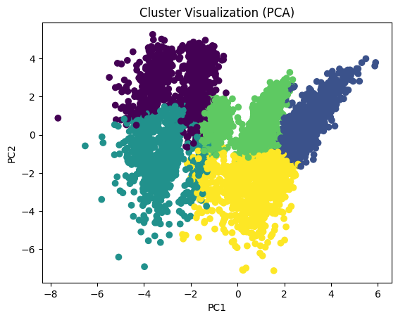
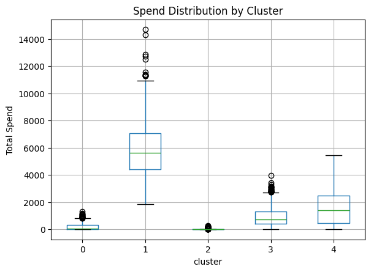

# 🚀 Ad-Tech User Segmentation using K-Means

## 📌 Overview

This project builds a behavioral segmentation system inspired by real-world ad-tech platforms. It identifies distinct user groups based on engagement, conversion, and spending patterns to optimize marketing strategies.

---

## 🧠 Problem Statement

In digital advertising, not all users behave equally. This project answers:

* Who are the high-value users driving revenue?
* Which users are over-targeted but not engaging?
* Which users show intent but fail to convert?

---

## ⚙️ Approach

### Data Simulation

Generated realistic event-level data:

* Impressions → Clicks → Add-to-Cart → Purchases
* Simulated multiple user personas (high intent, fatigued, dormant, etc.)

---

### Feature Engineering

Transformed raw events into user-level behavioral features:

* Funnel: CTR, CVR
* Behavioral: Recency, Activity
* Monetary: Total Spend, AOV
* Advanced: Ad Fatigue Score, Category Entropy

---

### Clustering

* Applied K-Means with scaling and log transformation
* Selected optimal K using Elbow + Silhouette methods

---

### Validation (Key Highlight)

* Evaluated cluster stability using Adjusted Rand Index across multiple runs
* Ensured robustness and reproducibility

---

## 📊 Key Insights

| Segment           | Insight                                 |
| ----------------- | --------------------------------------- |
| High Value Users  | High CTR, CVR, and revenue contribution |
| Ad-Fatigued Users | High impressions but low engagement     |
| Window Shoppers   | High clicks, low conversions            |
| Dormant Users     | Low activity and low value              |
| Efficient Users   | Balanced engagement and conversion      |

---

## 📈 Sample Visualizations

### PCA Cluster View



---

### Spend Distribution



---

## 💼 Business Impact

* Improved targeting by identifying high-value users
* Reduced wasted ad spend via fatigue detection
* Highlighted conversion opportunities in high-intent segments

---

## 🛠️ Tech Stack

* Python (pandas, numpy, sklearn)
* K-Means Clustering
* PCA
* Matplotlib

---

## ▶️ Run on Colab

Add your Colab link here

---

## 📁 Project Structure

```id="structure_block"
notebooks/        → main analysis notebook  
outputs/          → plots and results  
```

---

## 🚀 Future Work

* Time-based cluster transitions
* Comparison with DBSCAN
* Production pipeline simulation
